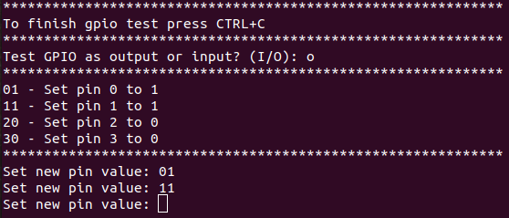
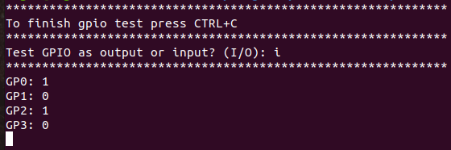
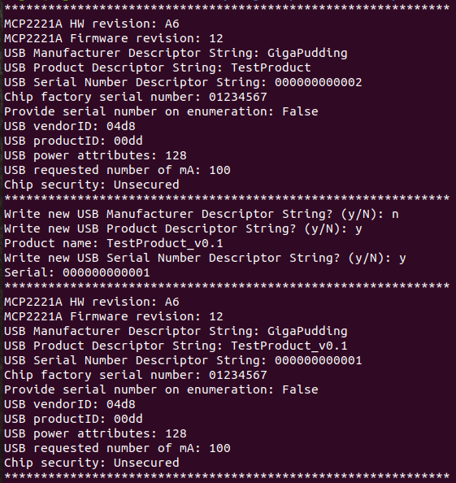
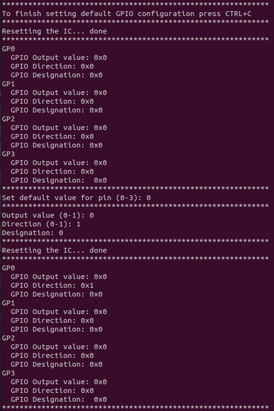

= MCP2221A python test
:toc:
:sectnums:
:sectnumlevels: 4

* Really simple python scripts to test MCP2221A

* Tested with `Python 3.9.5`

* Starting point of this code was taken from
link:https://gist.github.com/twitchyliquid64/a093ce11245274a2adeb631ccd2ba7eb[twitchyliquid64 - mcp2221a_set_strings.py]

== Implemented
* [x] Setting USB descriptor strings
* [x] Controlling GP as outputs/inputs (for now only one option is possible for all pins)
* [x] Setting default GP configuration (the one active after power-up)
* [ ] DAC
* [ ] ADC
* [ ] I2C

== Dependencies
* `pyusb`: `python -m pip install pyusb`
* `libusb`:
** Arch Linux: `sudo pacman -S libusb`
* On Linux you need to add MCP2221A to udev rules:
. Copy link:99-MCP2221A.rules[99-MCP2221A.rules]: `sudo cp 99-MCP2221A.rules /etc/udev/rules.d/`
. Log out then back in

== Examples

=== testGpio.py
* Test GP as input or output

* Run: `python3 testGpio.py`
* link:testGpio.py[Open file]

=== setDescriptorStrings.py
* Print some MCP2221A parameters
* Set USB Manufacturer, Product and Serial Descriptor Strings (they are used during the USB enumeration)

* Run: `python3 setDescriptorStrings.py`
* link:setDescriptorStrings.py[Open file]

=== setFlashGpioSettings.py
* Set default GPIO configuration (configuration which is active after power-up)

* Run: `python3 setFlashGpioSettings.py`
* link:setFlashGpioSettings.py[Open file]

== MCP2221A.py
* Main library
* link:MCP2221A.py[Open file]
