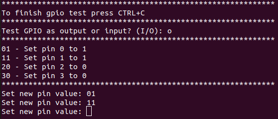
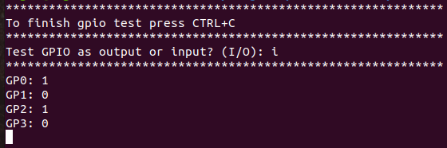
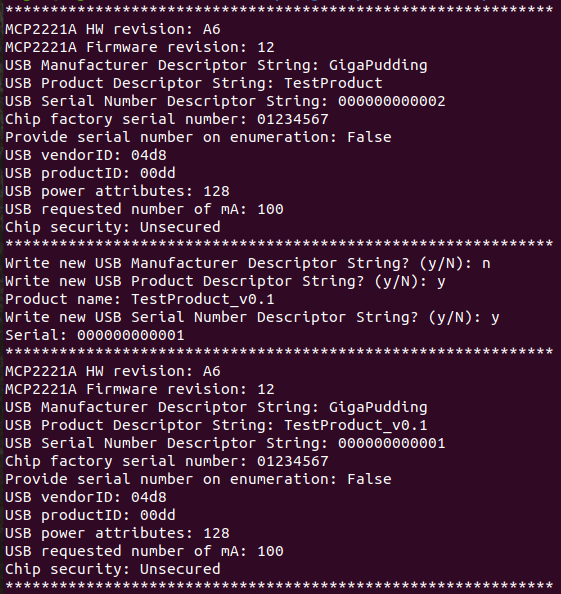
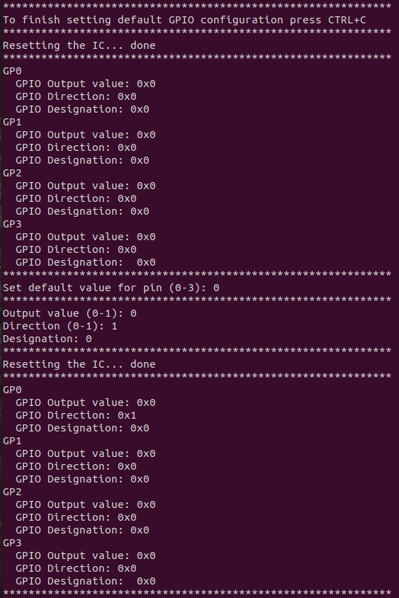

## MCP2221A python test
- Really simple python scripts to test MCP2221A
- Tested with `Python 3.8.5`
- Starting point of this code was taken from [twitchyliquid64 - mcp2221a_set_strings.py](https://gist.github.com/twitchyliquid64/a093ce11245274a2adeb631ccd2ba7eb)

### Implemented
- [x] Setting USB descriptor strings
- [x] Controlling GP as outputs/inputs (for now only one option is possible for all pins)
- [x] Setting default GP configuration (the one active after power-up)
- [ ] DAC
- [ ] ADC
- [ ] I2C

### Dependencies
- pyusb
- libusb
### testGpio.py
- Test GP as input or output

 

- Run: `python3 testGpio.py`
- [Open file](./testGpio.py)
### setDescriptorStrings.py
- Print some MCP2221A parameters
- Set USB Manufacturer, Product and Serial Descriptor Strings (they are used during the USB enumeration)

- Run: `python3 setDescriptorStrings.py`
- [Open file](./setDescriptorStrings.py)
### setFlashGpioSettings.py
- Set default GPIO configuration (conguration which is active after power-up)

- Run: `python3 setFlashGpioSettings.py`
- [Open file](./setFlashGpioSettings.py)
### MCP2221A.py
- Main library
- [Open file](./mcp2221a.py)
